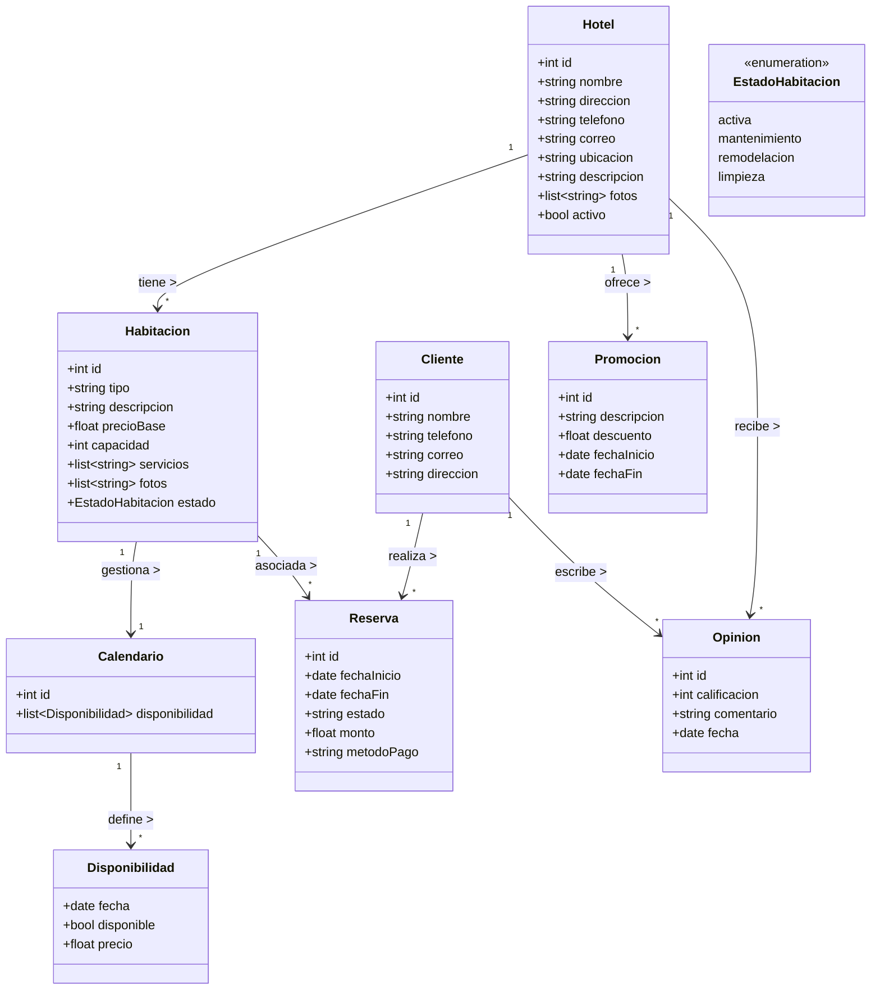

```mermaid
classDiagram
    %% =====================
    %% Clases principales
    %% =====================

    class Hotel {
        +int id
        +string nombre
        +string direccion
        +string telefono
        +string correo
        +string ubicacion
        +string descripcion
        +list~string~ fotos
        +bool activo
    }

    class Habitacion {
        +int id
        +string tipo
        +string descripcion
        +float precioBase
        +int capacidad
        +list~string~ servicios
        +list~string~ fotos
        +EstadoHabitacion estado
    }

    class Reserva {
        +int id
        +date fechaInicio
        +date fechaFin
        +string estado
        +float monto
        +string metodoPago
    }

    class Cliente {
        +int id
        +string nombre
        +string telefono
        +string correo
        +string direccion
    }

    class Opinion {
        +int id
        +int calificacion
        +string comentario
        +date fecha
    }

    class Promocion {
        +int id
        +string descripcion
        +float descuento
        +date fechaInicio
        +date fechaFin
    }

    class Calendario {
        +int id
        +list~Disponibilidad~ disponibilidad
    }

    class Disponibilidad {
        +date fecha
        +bool disponible
        +float precio
    }

    %% =====================
    %% Enumeraciones
    %% =====================

    class EstadoHabitacion {
        <<enumeration>>
        activa
        mantenimiento
        remodelacion
        limpieza
    }

    %% =====================
    %% Relaciones
    %% =====================

    Hotel "1" --> "*" Habitacion : tiene >
    Hotel "1" --> "*" Promocion : ofrece >
    Habitacion "1" --> "1" Calendario : gestiona >
    Calendario "1" --> "*" Disponibilidad : define >
    Habitacion "1" --> "*" Reserva : asociada >
    Cliente "1" --> "*" Reserva : realiza >
    Cliente "1" --> "*" Opinion : escribe >
    Hotel "1" --> "*" Opinion : recibe >

```